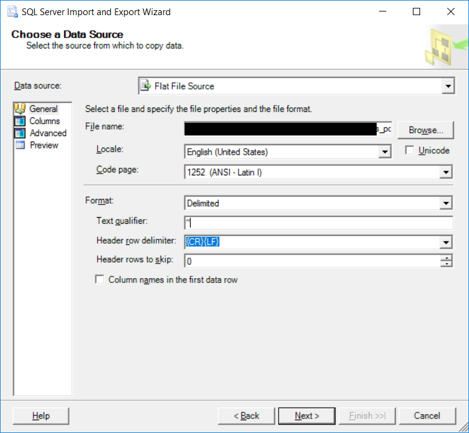
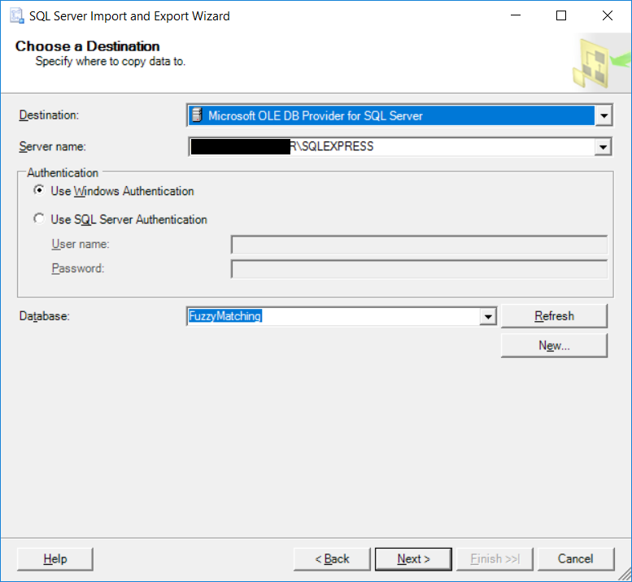
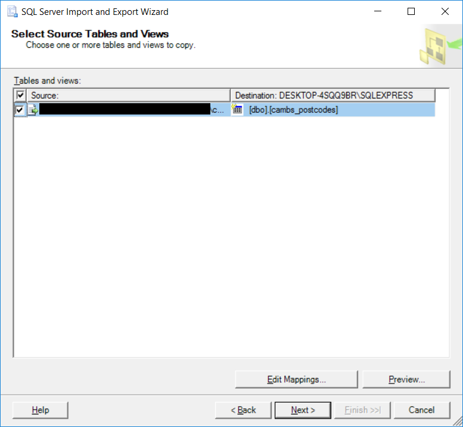
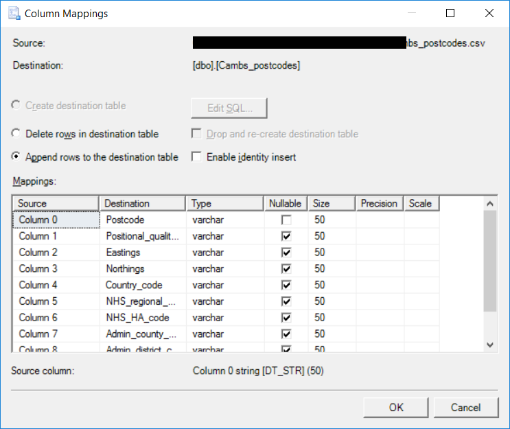
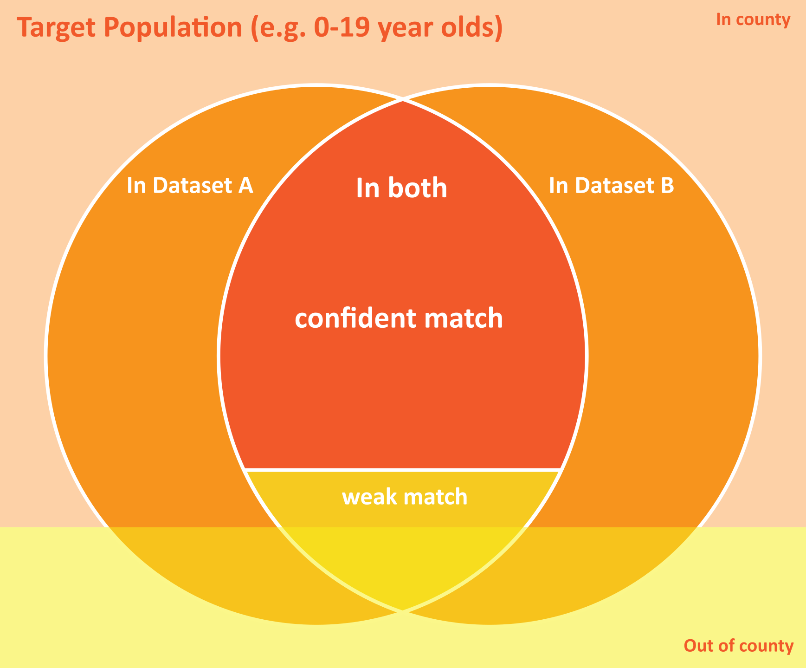

# fuzzy-matching
Fuzzy matching recipe for Local Authority datasets

This example works with SQL Server.  Tested with [SQL Server Express 2016](https://www.microsoft.com/en-us/sql-server/sql-server-editions-express)
and [SQL Server Management Studio](https://docs.microsoft.com/en-us/sql/ssms/download-sql-server-management-studio-ssms)

The example is based on Cambridgeshire and on a target population 0-19 but the approach could be easily adapted to other regions and age ranges.

## Purpose
Performs fuzzy matching between two datasets based on:

* Date of birth
* Phonetic match (soundex) surname
* Surname				
* Postcode				
* First part of address	
* Gender				
* First Initial		
* Phonetic match (soundex) First name	
* First name

and returns aggregated de-identifed results to inform Business Intelligence work around linked data and master data management.

## Instructions:
1. Create empty [FuzzyMatching] database and run the [FuzzyMatching.sql](FuzzyMatching.sql) script.
2. Populate [dbo].[Dataset_A] and [dbo].[Dataset_B] tables (via Tasks -> Import Data in SQL Server Management Studio)
3. (optional) import [cambs_postcodes.csv](cambs_postcodes.csv) into [dbo].[Cambs_postcodes]	(via Tasks -> Import Data in SQL Server Management Studio)
   *
   *
   *
   *
4. (optional) execute [dbo].[UpdateDataset_A_in_county] to update Dataset_A in_county flag based on CodePointOpen 
5. (optional) execute [dbo].[UpdateDataset_B_in_county] to update Dataset_B in_county flag based on CodePointOpen 
6. Execute [dbo].[MatchingOverview] stored procedure and save results
7. Execute [dbo].[PerformFuzzyMatching] stored procedure and save results

## Required output
The table produced by the fuzzy matching algorithm should be aggregated and sufficiently pseudonomised to prevent identification of individuals from either dataset.  It should also contain sufficient information to indicate the coverage and quality of the matching in relation to the target population.  The results should also be able to be filtered by age range and gender.

### Example output table.

Dataset_A_count|Dataset_B_count|A_in_county|B_in_county|age_range|A_gender|B_gender|matching_score|bit_score|match_type
---------------|---------------|-----------|-----------|---------|--------|--------|--------------|--------|----------
7|7|1|1|0-4|F|F|255|11111111|AB
10|10|1|1|0-4|M|M|255|11111111|AB
13|13|1|1|05-10|F|F|255|11111111|AB
9|9|1|1|05-10|M|M|255|11111111|AB
15|15|1|1|11-15|F|F|255|11111111|AB
11|11|1|1|11-15|M|M|255|11111111|AB
10|10|1|1|16-19|F|F|255|11111111|AB
8|8|1|1|16-19|M|M|255|11111111|AB
1|1|1|1|over 19|F|F|255|11111111|AB
2|2|1|1|over 19|M|M|255|11111111|AB
1|1|1|1|05-10|f|F|254|11111110|AB
2|2|1|1|05-10|f|F|254|11111110|B
1|1|1|1|05-10|F|F|252|11111100|AB
1|1|1|1|05-10|M|M|252|11111100|AB
1|1|1|1|11-15|M|M|252|11111100|AB
1|1|1|1|16-19|F|F|252|11111100|AB
1|1|1|1|16-19|M|M|252|11111100|AB
1|1|1|1|0-4|m|m|248|11111000|A
1|1|1|1|16-19|F|F|248|11111000|AB
1|1|1|1|11-15|F|M|247|11110111|AB
1|1|1|1|11-15|M|F|247|11110111|AB
1|1|1|1|16-19|F|M|247|11110111|AB
1|1|1|1|over 19|M|m|238|11101110|AB
1|1|0|1|11-15|M|M|223|11011111|AB
1|1|1|0|11-15|F|F|223|11011111|AB
1|1|1|1|11-15|M|M|223|11011111|AB
1|1|1|1|05-10|F|M|196|11000100|AB
1|1|1|1|05-10|F|F|191|10111111|A
2|2|1|1|05-10|F|F|191|10111111|AB - rejected
1|1|1|1|11-15|F|F|191|10111111|AB
1|1|1|1|0-4|M|M|190|10111110|AB
1|1|1|1|05-10|F|F|190|10111110|A
2|2|1|1|05-10|F|F|190|10111110|AB - rejected
1|1|1|1|05-10|M|M|63|00111111|AB
1|1|1|1|05-10|F|M|55|00110111|AB - rejected
2|2|1|1|05-10|F|M|54|00110110|AB - rejected
3|3|1|1|05-10|F|F|12|00001100|AB - rejected
0|11|NULL|1|0-4|NULL|F|0|00000000|unmatched (B)
0|9|NULL|1|0-4|NULL|M|0|00000000|unmatched (B)
0|13|NULL|1|05-10|NULL|F|0|00000000|unmatched (B)
0|23|NULL|1|05-10|NULL|M|0|00000000|unmatched (B)
0|10|NULL|1|11-15|NULL|F|0|00000000|unmatched (B)
0|8|NULL|1|11-15|NULL|M|0|00000000|unmatched (B)
0|10|NULL|1|16-19|NULL|F|0|00000000|unmatched (B)
0|8|NULL|1|16-19|NULL|M|0|00000000|unmatched (B)
0|4|NULL|1|over 19|NULL|F|0|00000000|unmatched (B)
0|3|NULL|1|over 19|NULL|M|0|00000000|unmatched (B)
13|0|1|NULL|0-4|F|NULL|0|00000000|unmatched (A)
9|0|1|NULL|0-4|M|NULL|0|00000000|unmatched (A)
10|0|1|NULL|05-10|F|NULL|0|00000000|unmatched (A)
17|0|1|NULL|05-10|M|NULL|0|00000000|unmatched (A)
8|0|1|NULL|11-15|F|NULL|0|00000000|unmatched (A)
11|0|1|NULL|11-15|M|NULL|0|00000000|unmatched (A)
13|0|1|NULL|16-19|F|NULL|0|00000000|unmatched (A)
7|0|1|NULL|16-19|M|NULL|0|00000000|unmatched (A)
2|0|1|NULL|over 19|F|NULL|0|00000000|unmatched (A)
3|0|1|NULL|over 19|M|NULL|0|00000000|unmatched (A)

### Match type

Match type|Meaning
----------|-------
AB|The match was the most confident (top match) from both A->B and B->A
A|The match was the most confident (top match) from A->B but not from B->A.  This may indicate duplicate records in dataset.
B|The match was the most confident (top match) from B->A but not from A->B.  This may indicate duplicate records in dataset.
AB - rejected|This match was disregarded by the fuzzy matching algorithm because there was a match with a higher score.
unmatched (A)|no record existed in dataset_B with the same date of birth as these records from dataset_A.
unmatched (B)|no record existed in dataset_A with the same date of birth as these records from dataset_B.

### Bit score
The bit score decodes the score to indicate which elements were matched

1|1|1|1|1|1|1|1
-|-|-|-|-|-|-|-
Phonetic match (soundex) surname|surname|Postcode|First part of address|Gender|First Initial|Phonetic match (soundex) First name|First name

## Database Objects
### Tables:				
#### [dbo].[Cambs_postcodes]
To store OS CodePointOpen postcodes in Cambridgeshire
#### [dbo].[Dataset_A]
To be populated with demographic data from the primary system (for example a Local Authority Children's Management Information System)
#### [dbo].[Dataset_B]
To be populated with equivalent demographic data from a second system (for example a Local Authority Libraries Management System)
### Utility Scalar Functions:			

#### [dbo].[GetAgeAtDate]
Returns age at a given date (specified in @EffectiveDate parameter)
#### [dbo].[GetAgeRange]
Returns an age range category (0-4, 05-10, 11-15, 16-19, over 19) as at the specified @EffectiveDate
#### [dbo].[GetFirstLetter]
Returns first letter in a string
#### [dbo].[GetFirstTwoWords]
Returns first word in a string (all characters up to the second space)
#### [dbo].[GetFirstWord]
Returns first word in a string (all characters up to the first space)
#### [dbo].[HarmoniseAddressLine]
Harmonises first part of address for fuzzy matching.  From previous work I believe 'APARTMENT','FLAT','THE','UNIT' are the most common first words within Cambridgeshire.  These are expanded to include the second word to increase uniqueness.  Further analysis of Cambridgeshire addresses could be used to improve this function.
#### [dbo].[HarmonisePostcode]
Extracts and harmonises postcodes into a consistent for fuzzy matching (adapted from http://www.hexcentral.com/articles/sql-postcodes.htm)
#### [dbo].[IntToBinary]
Used to convert the match score back to a binary representation (making it easier to identify which parts matched).  Copied from: https://www.codeproject.com/Articles/210406/INT-to-BINARY-string-in-SQL-Server
#### [dbo].[Match]
Matches two strings, first converting each to UPPERCASE then trimming any white space from the start and end
#### [dbo].[SoundexMatch]
Matches two strings phonetically using the soundex algorithm. Reference:   https://docs.microsoft.com/en-us/sql/t-sql/functions/soundex-transact-sql

### Stored Procedures:
#### [dbo].[MatchingOverview]
Produces summary stats for venn diagram (and to cross check with fuzzy matching totals)
#### [dbo].[PerformFuzzyMatching]
Performs fuzzy matching between Dataset_A and Dataset_B based on demographic data.
Requires an exact match on date of birth.  Then scores match based on following:

Aspect|Score
------|-----
SOUNDEX(Surname)|128
Surname|64
Postcode|32
First part of address|16
Gender|8
First Initial|4
SOUNDEX(First name)|2
First name|1

The score can be converted to a bit pattern to indicate which items were matched.  The order is intended to be based on the most unique identifiers.  However, this can always be refined based on testing.
#### [dbo].[UpdateDataset_A_in_county]
Left joins Dataset_A to Cambs_postcodes and updates the in_county field based on match.  The [dbo].[HarmonisePostcode] function is used to convert both postcode fields into a consistent format for matching.
#### [dbo].[UpdateDataset_B_in_county]
Left joins Dataset_B to Cambs_postcodes and updates the in_county field based on match.  The [dbo].[HarmonisePostcode]function is used to convert both postcode fields into a consistent format for matching.
